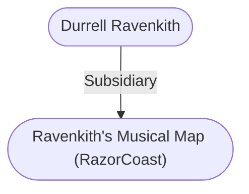

# Ravenkith's Musical Map (RazorCoast)
## Overview
---
## Connections

```mermaid
flowchart TD
Topic_6130(["Ravenkith's Musical Map (RazorCoast)"]); class Topic_6130 internal-link
Topic_6032(["Durrell Ravenkith"]); class Topic_6032 internal-link
Topic_6032-- "Subsidiary" -->Topic_6130
```
%%
links: [ [[ Durrell Ravenkith]] ]
%%

---
## Tags
#Story-Scope/RzrCoast-Non-Adventure-Content

