# 01 - World Building
## Overview
While running games within a published campaign setting or a favorite fictional universe is a lot of fun, many GMs enjoy creating an entire setting from scratch—a world in which every idea, NPC, and location, is an expression of your creativity. It’s a powerful feeling, one that can give you countless hours of enjoyment even outside of the game session.

Yet creating a setting from scratch can also be intimidating. This chapter provides you with tools to help take the guesswork out of world building, breaking down monumental considerations into small, manageable chunks. While this section (and indeed this book) presumes you’re creating a fantasy setting for use with the Pathfinder Roleplaying Game, most of this advice can be applied to any game genre or system. Keep in mind that not all of these questions need to be answered ahead of time, and creating as you play allows you to keep things fresh and fun for both you and your players.

---
## Governed Content
- [[01a - Defining a Setting]]
- [[01b - Tools of the Trade]]
- [[01c - Building a City]]

---
## Connections

```mermaid
flowchart TD
Topic_14959(["City Locations"]); class Topic_14959 internal-link
Topic_14960(["Buildings"]); class Topic_14960 internal-link
Topic_14962(["Inn (Building)"]); class Topic_14962 internal-link
Topic_14961(["zzBuildings"]); class Topic_14961 internal-link
Topic_16883(["01 - World Building"]); class Topic_16883 internal-link
Topic_14963(["zzBuildings Copy"]); class Topic_14963 internal-link
Topic_3576(["01c - Building a City"]); class Topic_3576 internal-link
Topic_14964(["The Draft House (Building)"]); class Topic_14964 internal-link
Topic_14964-- "Resident" -->Topic_16883
Topic_14963-- "Resident" -->Topic_16883
Topic_14960-- "Resident" -->Topic_16883
Topic_3576-- "Depended Upon By" -->Topic_16883
Topic_14960-- "Member" -->Topic_16883
Topic_14959-- "Resident" -->Topic_16883
Topic_3576-- "Resident" -->Topic_16883
Topic_14963-- "Member" -->Topic_16883
Topic_14963-- "Depended Upon By" -->Topic_16883
Topic_14962-- "Resident" -->Topic_16883
Topic_14962-- "Depended Upon By" -->Topic_16883
Topic_14960-- "Depended Upon By" -->Topic_16883
Topic_14961-- "Member" -->Topic_16883
Topic_14964-- "Member" -->Topic_16883
Topic_3576-- "Member" -->Topic_16883
Topic_14959-- "Depended Upon By" -->Topic_16883
Topic_14964-- "Depended Upon By" -->Topic_16883
Topic_14959-- "Member" -->Topic_16883
Topic_14961-- "Depended Upon By" -->Topic_16883
Topic_14961-- "Resident" -->Topic_16883
Topic_14962-- "Member" -->Topic_16883
```

%%
links: [ [[ zzBuildings Copy]], [[ The Draft House (Building)]], [[ zzBuildings]], [[ Inn (Building)]], [[ City Locations]], [[ Buildings]], [[ 01c - Building a City]] ]
%%

---
## Tags
#Rule/Core #Publisher/Paizo #Sources/PF-GameMastery-Guide

