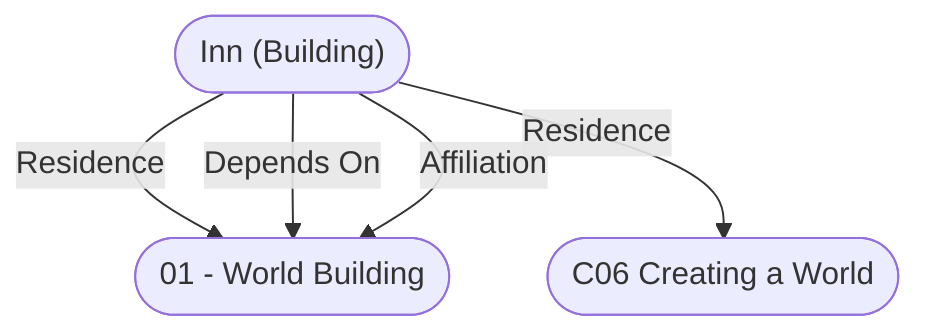

# Inn (Building)
## Overview
Inns are places that offer lodging for travelers to stay overnight or longer, providing more-or-less comfortable places to sleep and possibly also eat, bathe, have clothes laundered and boots cleaned, or have mounts and carriages tended to. Such places are also often convenient settings from which to arrange excursions into the local area or meet privately with acquaintances or business associates.

Inns are common in the merchants’ and foreigners’ quarters of larger towns and cities that are centers of trade or which attract visitors to worship at their temples or see their widely-reputed wonders. Many well-traveled routes also have inns at regular intervals in order to accommodate travelers during each night of their journeys, whether at crossroads, convenient spots along the highway, or in small villages. Inns might also be established near sites that attract significant numbers of visitors, such as temples that are pilgrimage destinations or natural landmarks of remarkable beauty.

Inns can vary widely in size, from modest buildings with a few small private rooms or a single shared bunkroom that can provide for a handful of guests, to large structures with numerous private, semiprivate, or common rooms that can accommodate dozens of visitors. Large inns located in villages or smaller settlements will often be the largest privately-owned buildings in such communities and might include numerous wings or be situated in compounds containing affiliated structures and businesses. Indeed, inns often include or are affiliated with taverns where guests and locals of good standing can share a drink or a meal and socialize, and many also provide amenities such as posting letters, money-changing, and storing valuables. Many, especially in societies where hygiene is important, will either have small bathhouses or provisions for bringing hot water and toiletries to each room.

Inns can help fulfill guests’ other needs, to include preparing for anything from another hard day of travel to attending important business meetings, religious services, or similar events. Some will even provide personal services, such as barbering or cleaning and mending of clothing; arranging for tradesmen like clothiers to call on guests; or maintaining a storefront near the inn to sell or rent appropriate formal wear (e.g., courtiers’ outfits at an inn near a seat of government). And at finer establishments, the innkeeper or a concierge may assist guests with purchases or arrangements they wish to make, drawing upon local contacts that outsiders may not otherwise have access to.

Design for a typical large inn might consist of two or three double-story wings partly encircling a courtyard where carriages can pull in to unload guests and luggage, with conveyances thereafter being taken to a coach house and draft animals to a stable by attendants. An innkeeper’s office and residence are usually next to the main entrance in order to welcome visitors when they arrive and to settle their bills when they leave, and the facility might have a small postern-gate from which guests can venture out into the surrounding area.

A number of variations on the inn concept might exist in any particular setting. Walled roadside inns specifically designed for use by merchants and their pack trains are often known as caravanserais. Inns that specialize in catering to people who visit them for recreational purposes, and which are often located near seashores, at oasis, or in other attractive or relaxing areas, are sometimes known as resorts. Country inns that provide accommodations and meals to visitors pursuing particular outdoor activities, such as hunting, fishing, or skiing, are often called lodges. And in some milieus, higher-end urban inns are known as hotels.

While many inns provide nothing but accommodations, especially in areas where a variety of other amenities are available, some also offer hearty meals. Often, aristocratic or wealthy guests are served in a separate dining room, or in their chambers, while their coachmen and other servants eat in the kitchen or taproom, where they can gossip and interact with the inn’s staff and various other working-class visitors (e.g., traveling hawkers, mercenaries, constables, royal messengers). Food served at inns is usually simple, common fare but, if one is known for a culinary specialty, it often consists of traditional local recipes that use ingredients such as game meats or wild herbs readily obtained in the immediate area.

In temperate countries — where the first desire of guests stumbling in from long winter journeys is to get warm — both common rooms and private chambers of inns are generally built around large fireplaces venting to a number of shared chimneys. Kitchens at such inns also consume a great deal of fuel, as hot meals and mulled wine are much in demand, and collecting and stockpiling of firewood is therefore an important task for which the inn usually contracts local peasants.

Inns are quite often family businesses, with relatives of different ages filling jobs appropriate to their abilities and experience. Retired adventurers also often take up innkeeping, especially in undeveloped or frontier areas. Skilled innkeepers must, in any event, be proficient at many things, to include bookkeeping and purchasing and managing stocks of supplies in the largest operations.

Because the core purpose of an inn is to allow guests to rest peacefully and to travel through unfamiliar places without concern for injury to their persons or reputations, proprietors of such places are known for their distaste for openly rowdy or disreputable behavior, often adding extra charges to a guest’s bill to pay for damage caused. What goes on quietly in private rooms, of course, is another matter. In widely-literate societies, travel writers may publish or otherwise make known their good or bad impressions of inns, sometimes singling out one as the best in a locality, allowing such establishments to develop reputations far beyond their immediate surroundings. In a fantasy setting, bards might even celebrate particular inns as the best in all the world, the last outposts of civilization on chaotic frontiers, or as reliable starting points for quests, lending them an almost mythic significance.

Although few peoples travel as widely or with as much expectation of comfort as Humans, all civilized races maintain lodgings of one sort or another for visitors, and Dwarves, Elves, Gnomes, and Halflings all have their own distinct traditions of hospitality. Among the less-civilized humanoids, Goblinoids are known for periodically providing austere, barracks-like inns for those with business in their communities. Gnolls, too, sometimes maintain caverns, ruins, and the like for use by different bands — under a rough and often-disregarded custom of truce — as hunting lodges, occasionally with groups of subservient beings residing nearby to render services.

**Adventure Hooks**

- An innkeeper might present characters that have stayed at his establishment with a long list of charges, totaling to an enormous sum that is more than they can easily pay. Characters might be inclined to dispute the bill (e.g., on the basis of fraud or intolerably poor service), to skip out without paying, or to take on a side task to cover their debts.
- Private rooms at inns are often used to host meetings and assignations of all kinds, including ones where the disparate parties mistrust each other to the point of preparing for deadly violence. Anything that goes wrong in such a fraught situation might erupt into a violent assault, a conflict that spills from the room into chases through the corridors and stairwells of the inn, or an event unseen by others at the time that leaves behind a mysterious aftermath (and perhaps a dead body or three). Characters might be drawn into such conflicts either as participants in a meeting; as unwitting witnesses or targets of stray violence who just happen to be staying in the wrong inn at the wrong time; or by taking on an investigation that requires them to determine events that took place in an inn chamber hours, days, or even years before.

---
## Connections

%%
links: [ [[ 01 - World Building]], [[ C06 Creating a World]] ]
%%

---
## Tags
#Rule-System/Pathfinder #Rule/OGL #Rule/Location #Rule/3PP #Rule/Building #Publisher/Skirmisher-Game-Development-Group #Sources/City-Builder-A-Guide-to-Designing-Commuinities

