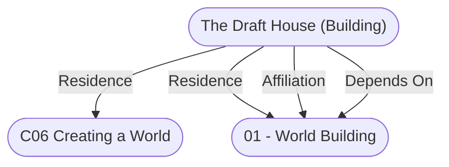

# The Draft House (Building)
## Overview
**The Draft House**

The Draft House a fine medium-sized inn that you expect to find in a friendly farming community or crossroads. It is comfortable, well-to-do, and welcoming to all travelers. The inn serves good home-cooked meals of hearty stews, roast meats, and produce. One the weekends, you can expect to find meat pies made from the week's leftover roasts. The Draft House Inn serves a wide mix of brews made by the local alewives as well as a handful of imported drinks.

In areas with a wilder local flavor, security can be a greater concern, and the inn may have a defensive out wall or be part of a small town and keep. 

**Exterior:** The stone walls of the old Draft House Inn have stood for decades - perhaps even a century. The building is well crafted, with fine mortared stone walls on the first floor and handsome half-timbered wattle and daub above. The aged walls look sturdy, although the irregular shape of the stones and thick timbers make for excellent handholds ([[Climb (Skill)|Climb]] DC 15). the windows on the ground floor are fortified with iron bars (Hardness 10; HP 60 ; Break DC 25) and each has a stone sill sloped to flow rainwater away from the windows. the windows higher up on the building are simpler, made from small leaded pains with wooden frames. The slate roof looks newer than the rest of the building, indicating that it must have been replaced at some time - more evidence to the age of the building. A brown and gold sign depicting a stout draft horse hangs over the door. The wooden front door is not overly large and is dark from age (sturdy, reinforced wooden door, Hardness 5; HP 35; Break DC 33; [[Disable Device (Skill)|Disable device]] DC 25).

**In the morning, add:** The Draft House Inn looms out of the morning fog with the inviting smells of breakfast eggs and bacon wafting from the kitchen chimney. 

**In the evening/night,  when the inn is crowded, add:** The muffled sounds of merriment and music call to you long before you reach the Draft House Inn. A couple of stragglers stumble out of the door making the music and other noises of the inn dramatically clear and louder for a moment. The laughter from within is infectious and you can't help but feel your spirits rise.

### First Floor
**First Floor**

**Taproom:** This large room has stone walls, except for a couple of interior walls made of wattle and dab. Four thick posts hold up the beams on which the ceiling rest. Dark oak floors show well-worn paths from the kitchen and bar to the more popular tables. A number of framed pictures of workhorses and farm scenes hang on the wall alongside a collection of well-used and broken farm tools - each, certainly, with its own story.

There is a small desk and stool just to the left of the entrance where guests can be greeted. A large stone fireplace is built into the wall to the left of the entrance and has a few seats gathered around it. Beyond it, a small cabinet occupies the corner, holding extra plates and glasses, and giving the staff a place to rest dishes coming from the kitchen. The bar takes up much of the wall across from the main entrance. A wooden staircase climbs to the second floor with still more cabinets nestled beneath it, filled with plates and flatware. The wall on the right has two doors: one is heavly like the front door (sturdy, reinforced wooden door, Hardness 5; HP 35; Break DC 33; [[Disable Device (Skill)|Disable Device]] DC 25), the other lighter and more ornate (fine wood door; Hardness 5; HP 15; Break DC 18; [[Disable Device (Skill)|Disable Device]] DC 25). The space in the middle of the room is filled with a number of round tables and a couple of longer, rectangular ones. The tables are surrouned by simple chairs and benches.

**In morning, add:** Four patrons at a long table near the patio barely look up from their breakfast to acknowledge your arrival. The middle-aged woman cleaning mugs behind the bar tells your party to "Sit where you will, and we'll have a proper breakfast in no time." The old wood floor creaks with your every step, obviously used to handling far more weight.

**In evening/night, when the inn is crowded, add:** Once you have had a look around, the next thing you notice is the smell - a savory mixture of spiced meats, potatoes, bread, and pies, all mixed with the heady aroma of well-aged spirits and strong ale. The innkeeper, an older man in an apron, stands a bit back from the fireplace, directing the activity. Two comely serving wenches weave among crowded tables, taking orders and delivering foodand drinks to waiting patrons. One of the lasses, clearly a bit overworked - but still smiling, hurries past you with a tray of drinks and says, "Sit anwhere ya can find room." A table on the left side of the room is open as well as some seats at the bar.

**Bar:** This old oak bar has been polished over the years to a satin shine. Against the wall behind the bar is a rack with a number of tapped casks of local ales and ciders. Additional options, as well as some inexperienced spirits, hide beneath the bar top while more fine alcohols rest on a small cabinet behind the bar. Above the top-shelf beverages are a series of small hooks with keys for the rooms upstairs

.

**In evening/night, when the inn is crowded, add:** Most of the stools at the bar are inhabited by smiling, jovial locals imbibing in their favorite spirits. As you approach, they are more than happy to welcome you into their midst. The barkeep, a middle-aged man with a bit of a paunch, nods in your direction as he finishes filling a pair of ale mugs. After dropping the drinks in front of another pair at the bar, he smiles invitingly as he asks, "What can I get for you?"

**Kitchen:** The kitchen is not small, but the fires and tables littered about make the space feel tight. One wall is set aside for a large roasting spit over a fire pit. Tucked in a nearby corner, a small copper sink operates through use of a manual pump. Under the sink, a small pipe lets the drainage out through a small hole in the west wall. At the back of the kitchen is a proper stone oven and a small working table wedged between the oven and the pantry. The corner between the spit and the oven is home to tools used to tend the fires and manage the oven, as well as a couple of brooms. The bulk of the kitchen work is handged on a large butcher block table on the remaining wall. A variety of pots, pans, and plates are stowed on crowded shelves under the butcher block with rows of spices, cooking implements, and knives arranged on shelves above.

**In early morning, add:** This early in the day, the kitchen is empty except occasionally for the innkeeper making breakfast for his family, the folks that stayed overnight, and the rare morning visitor coming in for a bit of breakfast. A comfortable fire burns in the fireplace.

**In midday/afternoon, add:** The kitchen is busy. A stew simmers over the fire and bread bakes in the oven. The cook and her assistant move efficiently between the kitchen and pantry tidying up. gathering ingredients, and preparing them for the guests who will start showing up in a few hours.

**In evening/night, when the inn is crowded, add:** The cook and her assistant work diligently, trying their hardest to keep up with the orders from the front of the house. On the roasting spit, two cuts of meat sizzle, dressed in pepper and spices, while several different dishes are being prepared on the main table. The smell of baked pie wafts from the oven. Every few minutes, a barmaid or two make their way into the kitchen to get dishes bound for the customers out front.

**Pantry:** Along the wall behind the bar, the pantry is filled with all manner of cooking supplies - grains, honey, flour, spices, and more. Goods  that are best kept cooler, like milk, cream, vegetables, and cheeses are stacked low on shelves aginst the outside wall to keep them from spoiling. Finally, dried meats, mushrooms, and fruits are kept in sealed boxes on shelves under the stairs.

**Private Room:** The private room is the best-kept room in the building. The long table has eight of the most comfortable chairs in the house. A small cabinet sits in the northwest corner. The private room is a good option for a group that does not wish to have the regular customers butting into their dinner, plan-making, or treasure-dividing, and is willing to pay a little extra coin for the privilege.

**Patio:** In the center of the leveled flagstone patio sits a fire pit surrounded by wooden benches. A small table with a pair of chairs allows for more outdoor eating.

**In evening/night, when the inn is crowded, add:** A crowded of locals is gathered around the large open fire. The locals take turns singing songs and telling stories while barmaids come and go from the tap room with drinks for the thirsty patrons.

### First Floor
![[Inn Draft House First Floor.jpg|First Floor|300]]
[[Inn Draft House First Floor.jpg|First floor map of the Draft Horse Inn]]

### Second Floor
**Second Floor**

**Second Floor Hall:** Ascending from the tap room you find yourself in a hallway lined with doors. Most of the doors are labeled with brass numbers, 1 through 6. The remaining three doors are labeled with neatly painted letters. Two adjacent locked doors (wooden door, hardness 5; HP 15; Break DC 18; [[Disable Device (Skill)|Disable Device]] DC 20) are labeled "Staff Only" and lead to the closet and attic. The last door is labeled "Common Room." A couple of small windows let enough light in during the day, and a few strategically placed candle sconces solve that problem at night.

The numbered rooms can each be rented for 2 gp a night, except for Room 5 which rents for 4 gp a night. A bed in the common room is available for 5 sp a night.

**Room 1:** This simple room contains a comfortable bed suitable for one or two, a night stand, and a small desk. A couple of paintings hang on opposing walls and shaw a farm scene: first in the planting season and then at harvest time. A leaded glass window looks out of the back of the inn, providing light during the day. A candlestick on the night stand provides light at night. The door is stout and can be bolted from the inside (sturdy wooden door, hardness 5; HP 20; Break DC 23; [[Disable Device (Skill)|Disable Device]] DC 25).

**Room 2:** Behind the door labeled "2" is an arrangement suitable for a party of up to eight. Two beds are positioned across from the door. To the right of the door is an oversized bunk bed. A couple of night stands are within easy reach of the beds and a locked chest ([[Disable Device (Skill)|Disable Device]] DC 25) can be found here as well. A large framed pinting of a team of draft horses pulling a cart laden with grain hangs on the wall across from the door.

Aside from the light from the small leaded glass window, each nightstand has a candlestick. The door is stout and can be bolted from the inside (sturdy wooden door, hardness 5; HP 20; Break DC 23; [[Disable Device (Skill)|Disable Device]] DC 25).

**Room 3:** Two beds provide enough space to sleep two to four people. The room also includes two writing desks and a locked chest ([[Disable Device (Skill)|Disable Device]] DC 20). Each desk has an oil lampto provide enough light for reading and writing in the dark hours of the night. A pair of framed paintings of farm houses adorn the walls. This room seems a perfect solution for traveling merchants, mages, priests, and scholars. The door  is stout and can be bolted from the inside 􀁅􀁈􀀃􀁅􀁒􀁏􀁗􀁈􀁇􀀃􀁉􀁕􀁒􀁐􀀃􀁗􀁋􀁈􀀃􀁌􀁑􀁖􀁌􀁇􀁈􀀃􀀋􀁖􀁗􀁘􀁕􀁇􀁜􀀃􀁚􀁒􀁒􀁇􀁈􀁑􀀃􀁇􀁒􀁒􀁕􀀏􀀃􀀫􀁄􀁕􀁇􀁑􀁈􀁖􀁖􀀃􀀘􀀞􀀃(sturdy wooden door, hardness 5; HP 20; Break DC 23; [[Disable Device (Skill)|Disable Device]] DC 25).

**Room 4:** A simple but efficient room - a tiny window over a small writing desk looks out over the front of the inn. Aside from the plain bed, there is a locked chest ([[Disable Device (Skill)|Disable Device]] DC 20) and two small framed paintings (one of a horse􀀳􀀃􀀕􀀓􀀞􀀃􀀥􀁕􀁈􀁄􀁎􀀃􀀧􀀦􀀃􀀕􀀖􀀞􀀃􀀧􀁌􀁖􀁄􀁅􀁏􀁈􀀃􀀧􀁈􀁙􀁌􀁆􀁈􀀃􀀧􀀦 pulling a plow and the other of a simple farm house). The door is stout and can be bolted from the inside (sturdy wooden door, hardness 5; HP 20; Break DC 23; [[Disable Device (Skill)|Disable Device]] DC 25).

**Room 5:** This room has an oversized, comfortable bed. The bed is covered in a lavish quilt and has more pillows than most would deem necessary. It is more ornate than the other rooms at the inn and costs double the normal rate to rent. The locked chest ([[Disable Device (Skill)|Disable Device]] DC 25) and the nightstands are crafted from fine hardwood and have been carved with intricate designs. There is a framed painting of a proud draft horse hung over the bed. A tall mirror is mounted on the wall next to the chest. The room is usually rented to rich merchants or young couples. The door is stout and can be bolted from the insided (sturdy wooden door, hardness 5; HP 20; Break DC 23; [[Disable Device (Skill)|Disable Device]] DC 25).

**Room 6:** The small window in this room does not provide much light during the daylight hours. Of course, there is not much to see in this simple room. Aside from a plain bed, a tiny shelf under the window with a candlestick, and a common locked chest ([[Disable Device (Skill)|Disable Device]] DC 20), there are no other features or decorations. The door is stout and can be bolted from the inside (sturdy wooden door, hardness 5; HP 20; Break DC 23; [[Disable Device (Skill)|Disable Device]] DC 25).

**Common Room:** The common room is the largest room on this floor. It houses seven small straw-filled beds and an ample fireplace that is built into the wall. The room has a few locked chests ([[Disable Device (Skill)|Disable Device]] DC 25), the keys for which can be rented from the innkeeper (for 1 sp a night). Night tables are conveniently placed between most of the beds. A couple of dressers and a desk also fill the empty wall space around the room, each with a small washbasin. While the accomodations of the room are meager, they are certainly warmer than sleeping out on the road, and many of its patrons have indulged a bit too much to care about the details.

**In early morning, add:** A couple of patrons are sleeping off the effects of last night's reverie, but most of the beds are vacant. The fire was stoked sometime during the night to keep the room fairly cozy and warm, and it seems like the room has even been swept at some point in the last day or so.

**In evening/night, when the inn is crowded, add:** The beds in this room are empty but the rabble of the patrons downstairs can be clearly be heard. A few beds have been claimed with personal items tossed on them; items like traveling cloaks, simple bags, or sacks. An inspection of the items reveals nothing of great value. Undoubtedly, this room will start to fill up as the night goes on. Periodically, one of the staff comes in to tidy up a bit or stoke the fire.

**In the late night, add:** Most of the beds are occupied by quietly snoring patrons. Aside from their noise and the crackle of a low fire in the hearth, all is quiet.

**Closet:** The large walk- closet is filled with shelves of fresh linens, spare candles, washbasins, bedpans, and other sundries.

### Second Floor
![[Inn Draft House Second Floor.jpg|Second Floor|300]]
[[Inn Draft House Second Floor.jpg|open outside]]

### Third Floor
**Third Floor**

**Landing:** At the top of the stairs is a large landing that appears to act as a larger pantry for various items needed in the kitchen and bar. Several barrels of beer, ale, and mead are stacked near the railing with an armoire and a pair of shelves alongside them. A drawn curtain leads to a larger storage area built onto the rafters. A pair of shuttered doors opens out of the wall and over the patio where a hoist can be used to move heavy objects up to, and down from, the attic. There is a heavy locked wooden door (sturdy wooden door, hardness 5; HP 20; Break DC 23; [[Disable Device (Skill)|Disable Device]] DC 25).

**Secret Door, Perception DC 20:** Close inspection reveals that the shelf has been moved and replaced on occasion. Movign the shelf, you find a panel in the wall which can be removed to gain access into the unfinished attack above the guest rooms.

**Innkeeper's Apartment:** This large apartment seems more homey than the rooms downstairs. The walls have been painted in bolder colors and detailed with painted flowers and vines. The ridge of the roof spans the length of the room at 12 feet. From here, the ceiling slopes down to a little more than 6 feet above the floor. A large, woven rug covers a good deal of the floor in front of the stone fireplace. A small shelf sits on the north wall next to the family's dining table. Two locked chests ([[Disable Device (Skill)|Disable Device]] DC 25), one by the fireplace and the other by the door, hold the personal effects of the innkeeper's family. Nestled in one corner is a large bed with a fine straw-filled mattress. Tucked into an adjacent corner  is a bunk bed, and between them rests a small desk.

**Secret Door, Perception DC 25:** Scuff marks in the floor show that this desk has been moved away from the wall and replaced on occasion. Shifting the desk away from the wall reveals that behind the desk is a secret panel which can be removed to get into the unfinished attic.

**Storage Room:** The storage room has a low sloping roof and spans the entire back wall of the building. The space is packed with shelves and crates containing both dried goods for the kitchen as well as extra bedding and other equipment for the inn.

It is possible to eavesdrop on rooms 1 and 2 below the unfinished flooring and back of the room. The creaking of the ceiling boards incurs a -5 penalty on [[Stealth (Skill)|Stealth]] checks made in the storage room.

**Unfinished Attic:** The unfinished attack spans the entire south wall of the third floor and can only be accessed through the concealed entrances in the landing and the innkeeper's apartment. This is where the innkeeper stores a small strongbox with gold and other small valuables. If a guest needs to keep a treasure safe, it may also be stored here by the innkeeper. From the unfinished attic, it is possible to eavesdrop on rooms 3 through 6, as well as the common room below. The creaking of the ceiling boards incurs a -5 penalty on [[Stealth (Skill)|Stealth]] checks made in the attic.

### Third Floor
![[Inn Draft House Third Floor.jpg|Third Floor|300]]
[[Inn Draft House Third Floor.jpg|open outside]]

## NPCs
NPCs Associated with the Draft House in Midgard

Vasily Petrovic 

MERCHANT CR 5

Human, male, fighter 3/expert 2  XP 1,200

Medium humanoid (human) N

Init –1; Senses Perception +13

DEFENSE

AC 10, touch 9, flat-footed 10 (+1 armor, –1 Dex)

hp 31 (7d8)

Fort +3, Ref +2, Will +9

OFFENSE

Speed 30 ft.

Melee mwk silver dagger +5 (1d4–1/19–20)

Ranged mwk silver dagger +5 (1d4–1/19–20)

TACTICS

During Combat The expert hides behind his bodyguards or tries to use his potion of invisibility to escape combat. 

STATISTICS

Str 9, Dex 8, Con 10, Int 14, Wis 12, Cha 13

Base Atk +5; CMB +4; CMD 13

Feats Alertness, Iron Will, Persuasive, Skill Focus (Appraise, Intimidate)

Skills Appraise +15, Bluff +11, Diplomacy +13, Handle Animal +6, Intimidate +11, Knowledge (geography) +7, Knowledge (history, nobility) +4, Knowledge (local) +12, Perception +13, Profession (merchant) +11, Ride +9, Sense Motive +13, Survival +2

Languages Common, Dwarven, Elven

Combat Gear potion of cure moderate wounds, potion of invisibility; Other Gear masterwork silver dagger, bracers of armor +1, cloak of resistance +1, guard dog, magnifying glass, merchant’s scale, bit and bridle, heavy horses (2), light horse (combat trained), riding saddle, saddlebags, wagon, 720 gp

Vasily is pleasant to customers but can be an impatient taskmaster to his employees. He began his life as a fighting adventure but after several near death experience has spent the remainder of his lifetime thinking of ways to avoid physical danger.

Cook: Dagmar (human female expert 1) hp 10

Cook's Helper: Trebor (human male) hp5

Barmaid(s): Ludmila

                      Lizabetha

Maid(s): Betina

               Lostila

---
## Connections

%%
links: [ [[ 01 - World Building]], [[ C06 Creating a World]] ]
%%

---
## Tags
#Rule-System/Pathfinder #Rule/OGL #Rule/Location #Rule/3PP #Rule/Building #Sources/Red-Dragon-Inn-Guide-to-Inns-and-Taverns #Publisher/Slugfest-Games

