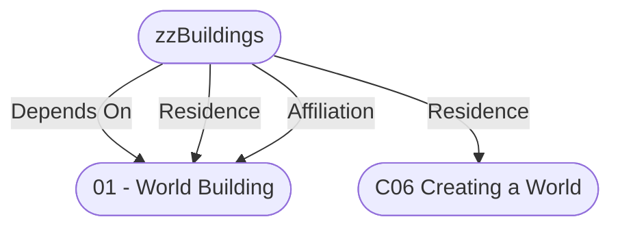

# zzBuildings
## Overview
xx

---
## Connections

%%
links: [ [[ 01 - World Building]], [[ C06 Creating a World]] ]
%%

---
## Tags
#Rule-System/Pathfinder #Rule/OGL #Rule/Location #Rule/3PP #Rule/Building #Rule/Core #Publisher/Paizo

