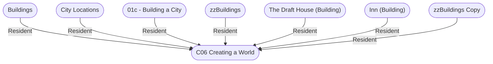

# C06 Creating a World
## Overview
---
## Governed Content
- [[01 - World Building]]
- [[02 - Detailing Your World]]
- [[Cultural Considerations]]
- [[Geography]]
- [[House Rules]]
- [[Other Societies]]
- [[Parallel Worlds]]
- [[Technology]]
- [[The Cosmopolitan Society]]
- [[The Cosmos]]
- [[The Feudal Society]]
- [[The Planes]]
- [[The Primitive Society]]
- [[The Rural_Agrarian Society|The Rural/Agrarian Society]]
- [[Time]]
- [[xx]]
- [[xx Copy Copy Copy]]

---
## Connections

%%
links: [ [[ zzBuildings Copy]], [[ The Draft House (Building)]], [[ zzBuildings]], [[ Inn (Building)]], [[ City Locations]], [[ Buildings]], [[ 01c - Building a City]] ]
%%

---
## Tags
#Sources/PF-GameMastery-Guide #Rule/Core #Publisher/Paizo

